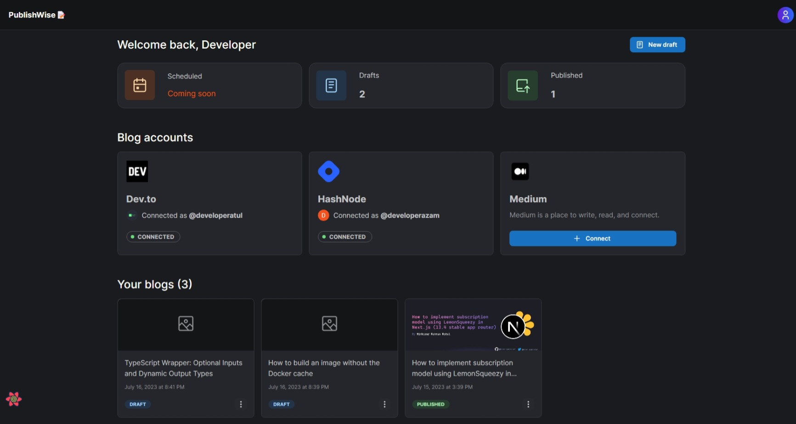
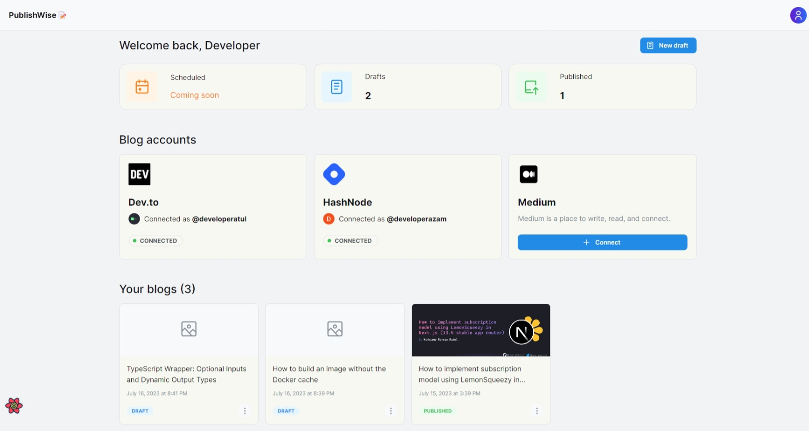
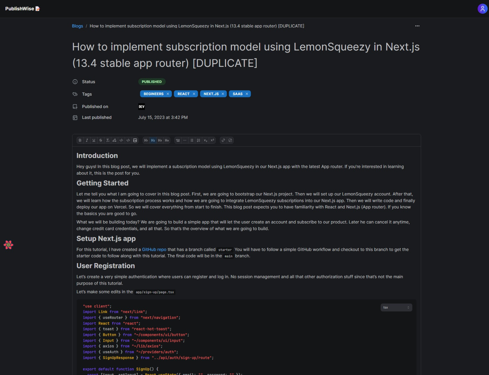
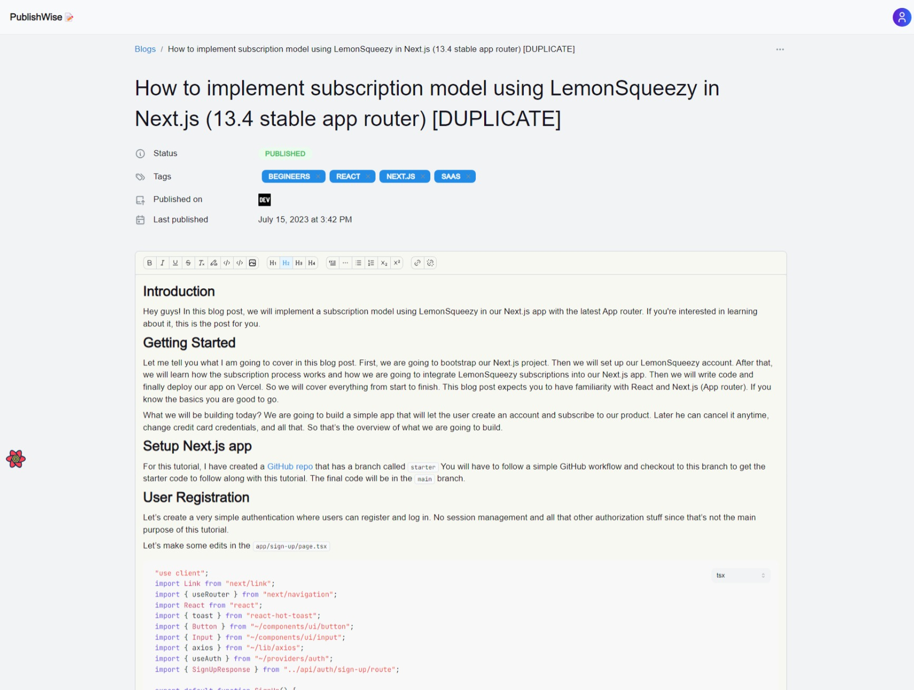
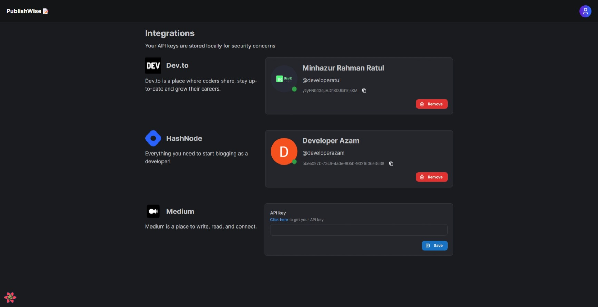
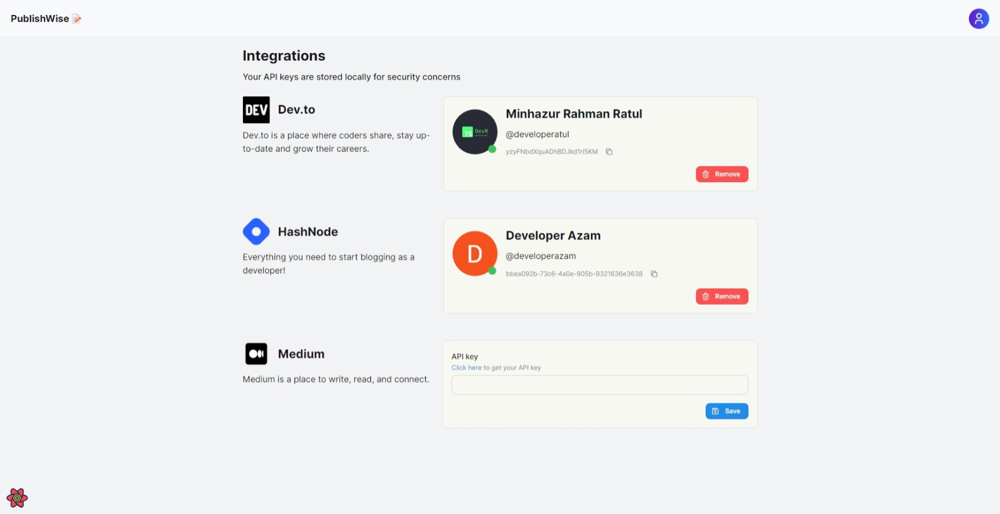

## PublishWise


### Project Demo link

The project is live at [PublishWise.ink](http://publishwise.ink)

## About

PublishWise is a tool that allows you to write and publish blogs from a single platform. It includes an ideal editor for writing blogs and publishing them on Dev.to and HashNode (with more to come). You can easily make updates to your blog that has been published in both Dev.to and HashNode by modifying it once on PublishWise. It simplifies cross-posting and consolidates your blogs onto a single platform. This project has a lot of potential and will continue to add more valuable features.

### Description

This project was built using Refine and supabase as the data provider. In this project, I have utilized refine data hooks for performing queries and mutations throughout the whole application. I have setup the notification and router provider in Refine. Also I have setup dark and light switching feature using Refine. Finally, I am using Mantine as the UI library with Refine. So in summary this project was build using Next.js (app dir), Refine, Supabase and Mantine.

### Participants

- Minhazur Rahaman Ratul ([@developeratul](http://developeratul.com))

### Preview

The dashboard (dark)


The dashboard (light)


The Editor



The Editor (light)



Settings



Settings (light)



Landing page (light)


### Prerequisites

```
Node >= 16
Yarn >= 1.22.19
Npm >= 8.11.0
```

### Install Project

For example:

- Clone the repository:

```
git clone git@github.com:developeratul/publish-wise-refine.git
```

- Change directory and install dependencies:

```
cd publish-wise-refine
yarn
```

- Create `.env` file and fill-up the credentials

```
cp .env.example .env
```

- If you have followed everything mention above properly, you should be able to run:

```
yarn dev
```

🚀
